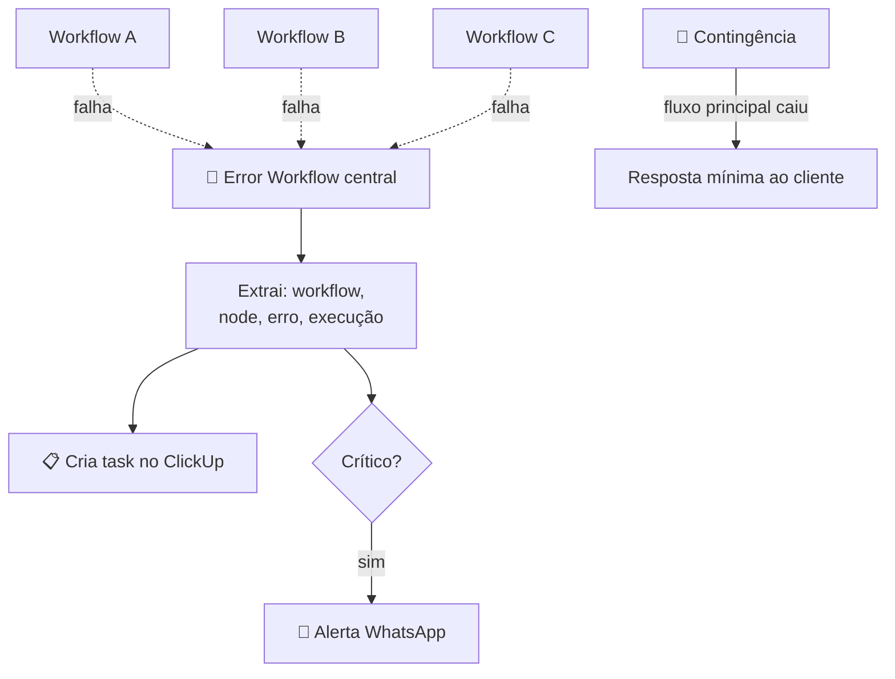

# 🔔 Observabilidade & Alerta de Erros (n8n)

> Captura falha em **qualquer workflow** automaticamente e **avisa a equipe** — com fluxo de contingência pra não deixar o cliente no escuro quando algo quebra.

> 🔒 **Case anonimizado.** Sem nome de cliente, credenciais ou dados reais.

---

## 🎯 O problema

Automação que roda 24/7 **vai falhar** em algum momento — API fora do ar, token expirado, payload inesperado. O perigo real não é a falha; é **descobrir tarde**, pelo cliente reclamando que o WhatsApp parou de responder.

Sem monitoramento, cada workflow é uma caixa-preta.

## ✅ A solução

Um **error workflow** central que o n8n aciona sempre que **qualquer** workflow falha, mais um fluxo de **contingência**:

- Captura o erro (workflow, node, mensagem, execução).
- Cria uma **task no ClickUp** com o contexto pra equipe agir.
- Pode notificar por **WhatsApp** os casos críticos.
- Contingência: garante uma resposta mínima ao cliente quando o fluxo principal cai.

---

## 🏗️ Arquitetura

---

## 🧩 Destaques técnicos

- **Error trigger global:** um único workflow registrado como handler de erro do n8n captura falhas de todos os outros — sem instrumentar cada um.
- **Contexto acionável:** a notificação traz workflow, node, mensagem e link da execução — quem recebe já sabe onde olhar.
- **Roteamento por severidade:** erro comum vira task; erro crítico dispara alerta imediato.
- **Contingência de atendimento:** quando o fluxo principal falha, um caminho alternativo evita silêncio total com o cliente.
- **Integração com gestão:** as falhas viram itens rastreáveis no ClickUp, não mensagens perdidas num chat.

## 🧰 Stack

| Camada | Tecnologia |
|---|---|
| Orquestração / captura | n8n (Error Trigger) |
| Gestão de incidentes | ClickUp |
| Alerta crítico | WhatsApp |

## 📈 Resultados

> Exemplos do que medir:
> - ⏱️ Tempo de detecção de falha: de _[horas, via reclamação]_ → _[minutos, automático]_
> - 🛟 % de incidentes resolvidos antes do cliente perceber
> - 📋 Histórico de incidentes rastreável

---

## 🔗 Projetos relacionados

- [ai-receptionist-clinics](https://github.com/iTristaoo/ai-receptionist-clinics) — um dos fluxos monitorados
- [ai-followup-automation](https://github.com/iTristaoo/ai-followup-automation) — também coberto pelo error handler
